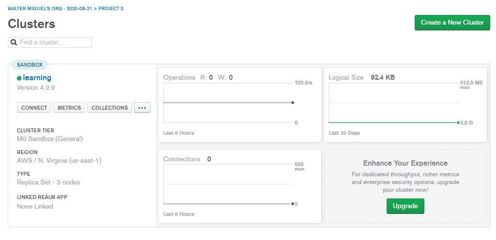
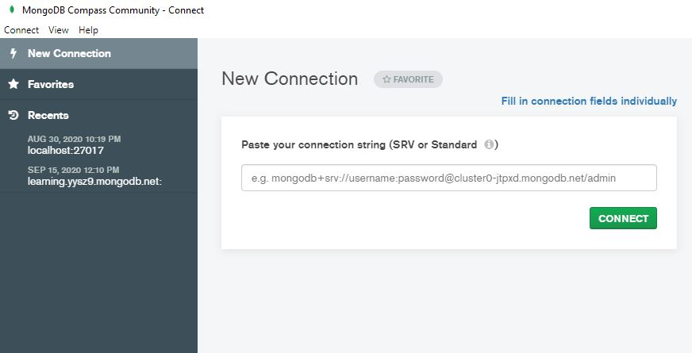
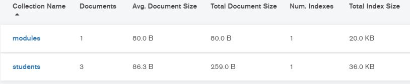
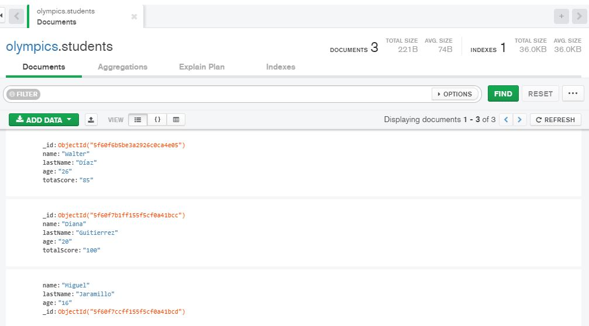
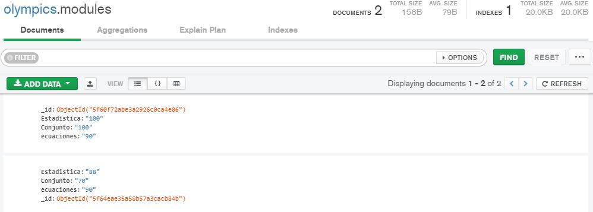
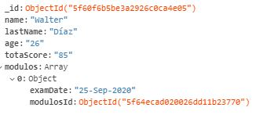

# Reto-MongoDB

## Base de datos noSQL

- Debes realizar base de datos de los resultados de las olimpiadas de matemáticas de estudiantes en edades de 16 - 20 años. Cada examen está compuesto por 3 módulos (estadística, conjuntos y ecuaciones), los cuales cuentan con calificación independiente y el resultado final por cada estudiante es el promedio de los 3 módulos.

-Se creo un cluster en Atlas MongoDB

- Se creo una Base de datos olympics
- Se le asigno un usuario
- Se permitio acceso a la ip local
- Se creo la conexion con Mongo Atlas a través de la URL

- Se crearon los esquemas de los Modulos y Calificaciones 

- Se creo los documentos de los estudiantes

- Se crearon los documentos para los Modulos de las calificaciones

- Se creo la relación de usuarios, donde se tiene un arreglo de objetos, donde un atributo es la fecha de aplicación y el siguiente el Id de las calificaciones por Modulo que se obtuvieron.

